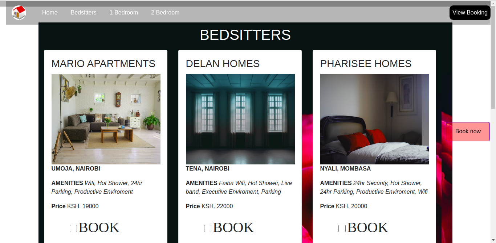
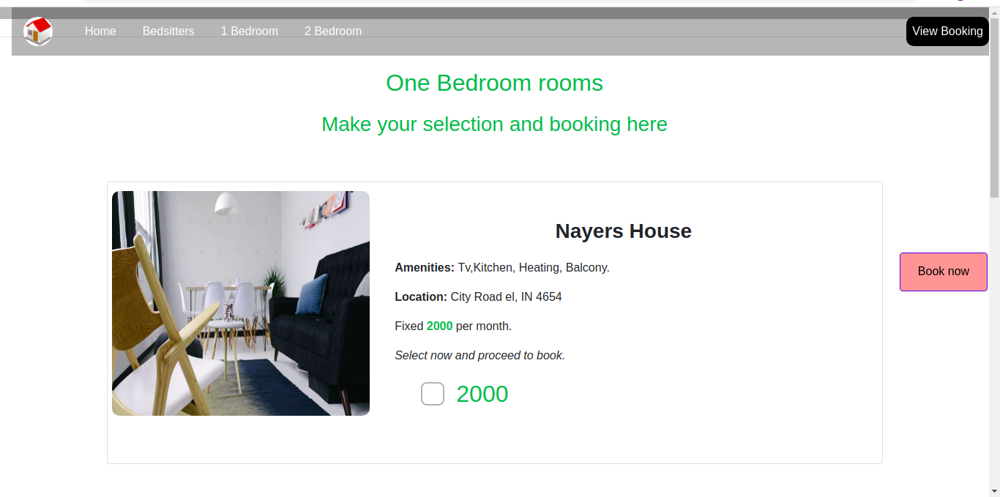
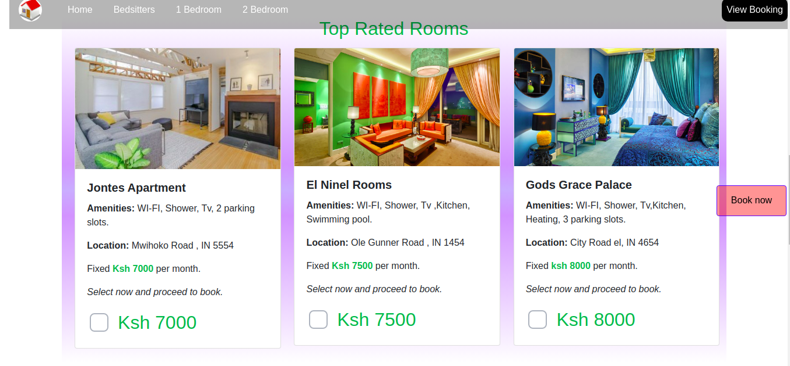

# room-booking

# Home page.

### Author name: Becky Nayere,Humphrey-Mutuma,Michael Omondi,Valentine Robai Inziani.Ken Mugai,John Otieno

#### Project description:
### This is room-booking online system for campus students.

The project has a selection section   where you select the room you want to book for the semester.
#### Rooms alocated according to sizes

- 2 bedroom
- 1 bedroom
- bedsitter

#### bedsitters

- Delan Homes
- Mario Appartments
- Pharisee Homes

#### 1bedroom

- Nayers House
- Keekorok House
- Cray Fish Houses

#### 2bedroom
[The 2 bedroom page] (images/2-bedroom-rooms.jpg)
#### Types of Top Rated Rooms;

- Jontes Appartments
- El ninel rooms
- God Grace Palace
- KingFisher Nest Appartments
- Pearl Palace
- Flema Guest Palece
- Paradise Gates 

After your selection, You now choose,the room or house you would want to pay for then you make the pay view your recipt and check in. and click on *View order* button.

The summary of the chosen room in the specific house or appartment will be viewed in the receipt.

# Receipt

This is a table that is showing a summary of all the  selections made with the cost of each room selected and the cumulative cost at the bottom.

##### Note: It is assumed that the room selected is in perfect condition.

- Form

# BDD

| Inputs  | Description  |
|---|---|
|Room size | Here you will select the size of the room or type of house.  |
| bedsitter  | Here you will select the type of bedsitter you want.  |
| 1 bedroom  |  Here you will select the specific one bedroom house you want. |
| 2 bedroom  |  Here you will select the type of two bedroom house that you'd want. |

### Expected output on the receipt table.
| Output  | Description  |
|---|---|
| bedsitter  |  The type of bedsitter selected will be displayed. with the cost|
|1 bedroom | The selected one bedroom house will be displayed here, with its cost.|	
|2 bedroom   | The two bedroom house selected  will be displayed here, with their total cost.|
|Total cost  | The total cost of the selected houses or rooms will be shown at the bottom of the receipt .|
### Technologies used;
> Bootstrap

> JavaScript

>Bootstrap

>HTML

> JQuery

>Markdown

Project setup instructions: You can fork this projects from GitHub.
 ### Development

Want to contribute? Great!

To fix a bug or enhance an existing module, follow these steps:

- Fork the repo

- Create a new branch (git checkout -b improve-feature)

- Make the appropriate changes in the files

- Add changes to reflect the changes made

- Commit your changes (git commit -am 'Improve feature')

- Push to the branch (git push origin improve-feature)

- Create a Pull Request

#### Demo : 
Here is the link to live demo [Click me] (https://github.com/humphrey-mutuma/room-booking.git)

Copyright and license information: This project is licensed under the terms of the [MIT license.](https://github.com/humphrey-mutuma/room-booking/blob/master/LICENSE.md)